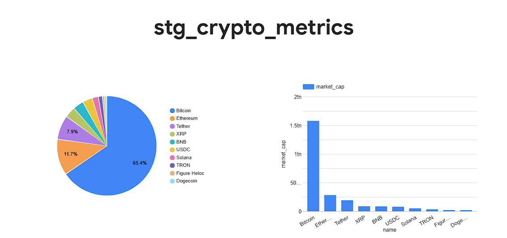

# CryptoPipe

CryptoPipe is a production-style ELT pipeline for automated crypto market monitoring. It ingests live market data from CoinGecko, lands the raw output in Google Cloud Storage and BigQuery, then uses dbt to build an analysis-ready table for reporting in Looker Studio.

## Project Objective

The problem this project solves is straightforward: cryptocurrency market data changes quickly, is highly nested, and is not useful for reporting until it has been structured and modeled. Querying an API on demand is inefficient, and attempting to analyze the raw response directly makes it harder to track market trends, compare coins, or build dashboards.

CryptoPipe addresses that by automating the full path from source API to warehouse-ready analytics. It centralizes ingestion, persists the raw data in cloud storage, stages the same data in BigQuery, and applies dbt business logic to calculate metrics such as volume efficiency and market-cap tiers. The result is a repeatable pipeline that is easier to audit, easier to scale, and easier to present to a reviewer.

This is intentionally ELT, not ETL. The raw data is loaded first into cloud systems, and the transformation happens later inside the warehouse with dbt. ETL would transform before loading; this project keeps the raw source intact until the analytical layer.

## Architecture Diagram

```text
+------------------------+
| CoinGecko API          |
| Top 10 market-cap coins|
+-----------+------------+
            |
            v
+------------------------+
| Mage.ai in Docker      |
| Python loader block    |
+-----------+------------+
            |
            v
   +--------+--------+
   |                 |
   v                 v
+----------------+  +-------------------------+
| GCS Data Lake  |  | BigQuery Raw Staging    |
| Parquet file   |  | top_crypto_prices       |
+----------------+  +-----------+-------------+
                                |
                                v
                     +-------------------------+
                     | dbt model               |
                     | stg_crypto_metrics      |
                     | partitioned by          |
                     | ingested_at (daily)     |
                     +-----------+-------------+
                                 |
                                 v
                     +-------------------------+
                     | Looker Studio           |
                     | dashboard               |
                     +-------------------------+
```

## Technologies Used

| Technology | Why it was chosen |
| --- | --- |
| Mage.ai | Orchestrates the pipeline and keeps the Python ingestion flow simple to run inside Docker. |
| Docker / Docker Compose | Provides a reproducible local environment for Mage, Terraform, and dbt. |
| Terraform | Provisions the GCS bucket and BigQuery dataset in Google Cloud using infrastructure as code. |
| Google Cloud Storage | Serves as the data lake for the exported Parquet file. |
| Google BigQuery | Serves as the warehouse for both the raw staging table and the dbt model output. |
| CoinGecko API | Supplies live market data for the top cryptocurrencies. |
| dbt | Handles SQL-based transformation, type casting, metric calculation, and partitioned table creation. |
| Looker Studio | Provides the BI layer for dashboards and reporting. |
| Python | Used in Mage for API extraction and export logic. |
| SQL | Used in dbt for the final analytical model. |

## Setup Instructions

### Prerequisites

- Docker installed
- Docker Compose installed
- A Google Cloud Platform project
- A GCP service account JSON key with the required permissions for Storage and BigQuery
- The service account file saved at the repository root as `creds.json`

### Files to update or configure

If you are setting this up for your own GCP account, these are the files that matter:

- `.env.example`: copy this to `.env` in the repository root and fill in your values.
- `.env`: keep the active environment variables here in the repository root.
- `creds.json`: provide your own service account key.
- `terraform/variables.tf`: set `project_id` and `bucket_name` if you do not want to rely on env vars.
- `default_repo/io_config.yaml`: set or override the GCP project ID used by Mage.
- `default_repo/data_exporters/export_to_gcs.py`: reads `GCS_BUCKET_NAME` so you do not have to edit the block code.
- `default_repo/data_exporters/export_to_bigquery.py`: reads `GOOGLE_CLOUD_PROJECT_ID`, `BIGQUERY_DATASET`, and `BIGQUERY_TABLE_NAME`.

Recommended approach: keep all shared variables in `.env`, then leave the code unchanged.

### Environment variables to set

Start by copying `.env.example` to `.env`, then replace the placeholder values:

```bash
cp .env.example .env
```

Put these values in `.env` at the repository root:

- `GOOGLE_CLOUD_PROJECT_ID`: your GCP project ID
- `GCS_BUCKET_NAME`: your GCS bucket name
- `TF_VAR_project_id`: your GCP project ID for Terraform
- `TF_VAR_bucket_name`: your GCS bucket name for Terraform
- `BIGQUERY_DATASET`: keep `cryptopipe_raw_data` or override it if you change the warehouse schema
- `BIGQUERY_TABLE_NAME`: keep `top_crypto_prices` unless you want a different raw table name

Example `.env` file:

```bash
GOOGLE_CLOUD_PROJECT_ID=your-project-id
GCS_BUCKET_NAME=your-unique-bucket-name
TF_VAR_project_id=your-project-id
TF_VAR_bucket_name=your-unique-bucket-name
BIGQUERY_DATASET=cryptopipe_raw_data
BIGQUERY_TABLE_NAME=top_crypto_prices
```

### 1. Clone the repository

```bash
git clone <your-repository-url>
cd CryptoPipe
```

### 2. Add Google Cloud credentials

Place your service account key in the repository root and name it exactly `creds.json`.

If you have not already done so, copy `.env.example` to `.env` and fill in the variables before starting Docker Compose.

### 3. Start the Docker environment

```bash
docker compose up --build
```

Leave this terminal running. Mage will be available on port `6789`.

### 4. Open a second shell in the container

```bash
docker compose exec mage bash
```

### 5. Provision infrastructure with Terraform

From inside the container:

```bash
cd /home/src/terraform
terraform init
terraform plan
terraform apply
```

Confirm the prompt with `yes` when Terraform asks to create the GCS bucket and BigQuery dataset.

If you used `TF_VAR_project_id` and `TF_VAR_bucket_name`, Terraform will pick them up automatically. Otherwise, edit [terraform/variables.tf](terraform/variables.tf) directly.

### 6. Run the Mage pipeline

Open Mage in your browser:

```text
http://localhost:6789
```

Then run the pipeline named `cryptopipe-pipeline`.

Current Mage flow in this repository:

1. `load_crypto_data` fetches the top 10 coins from CoinGecko.
2. The loaded dataframe is exported to GCS as a Parquet file.
3. The same dataframe is exported to BigQuery as the raw staging table.
4. dbt runs from the pipeline and builds the final analytical model.

The GCS export uses `GCS_BUCKET_NAME`, so the reviewer does not need to modify the block code unless they want a hardcoded bucket.

### 7. Run dbt manually if needed

If you want to run the warehouse transformation separately:

```bash
cd /home/src/default_repo/dbt_crypto
dbt run
```

## Transformation Logic

The final dbt model lives in [default_repo/dbt_crypto/models/stg_crypto_metrics.sql](default_repo/dbt_crypto/models/stg_crypto_metrics.sql).

It performs the following transformations:

- Casts `id`, `symbol`, and `name` to string fields.
- Casts `current_price` to `FLOAT64`.
- Casts `market_cap` and `total_volume` to `INT64`.
- Casts `last_updated` to `TIMESTAMP`.
- Generates `ingested_at` in dbt using `CURRENT_TIMESTAMP()`.
- Calculates `volume_to_mcap_ratio_pct` as:

```text
(total_volume / market_cap) * 100
```

- Assigns `market_cap_tier` using the following rules:
  - `Mega Cap` for market cap above 100 billion
  - `Large Cap` for market cap above 10 billion
  - `Mid Cap` for everything else

Partitioning strategy:

- The model is materialized as a BigQuery table.
- It is partitioned by `ingested_at` at daily granularity.
- This improves query performance and reduces scan cost for time-based analysis.

## Visualization

Public Looker Studio report link:

- https://datastudio.google.com/reporting/fc737673-1ed7-40c0-9150-5b2b03db97ae

Dashboard screenshot:



Suggested dashboard dimensions:

- Current price
- Market cap
- Total volume
- Volume-to-market-cap ratio
- Market cap tier

## Reviewer Notes

- The pipeline is intentionally built as ELT so the reviewer can inspect the raw BigQuery staging table before the final dbt model.
- The raw export is preserved in GCS as Parquet for lake-style storage and auditing.
- The final warehouse model is the main analysis surface for Looker Studio.
- The current repository paths place dbt under `default_repo/dbt_crypto`, not at the repository root.
- If you choose not to use environment variables, the main customization points are `creds.json`, `terraform/variables.tf`, `default_repo/io_config.yaml`, and the Mage exporter blocks.

## Key Files

- [Mage pipeline metadata](default_repo/pipelines/cryptopipe_pipeline/metadata.yaml)
- [CoinGecko loader](default_repo/data_loaders/load_crypto_data.py)
- [GCS exporter](default_repo/data_exporters/export_to_gcs.py)
- [BigQuery exporter](default_repo/data_exporters/export_to_bigquery.py)
- [dbt model](default_repo/dbt_crypto/models/stg_crypto_metrics.sql)